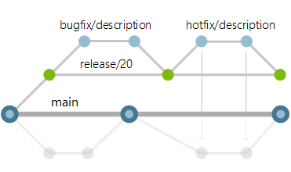

## Go project layout

> Description Project

[](https://forthebadge.com) [](https://forthebadge.com)

### Prerequisites

- Go 1.16+
- Docker (Developed with version 19.03)

### Create Config File

Create an env file development by copying the given example.

```
$ cp config/.env.defaultexample config/.env
```

## Developer Guide

### General Rules

* We use conventional commits to deal with git commits: https://www.conventionalcommits.org
    - Use `feat: commit message` to do git commit related to feature.
    - Use `refactor: commit message` to do git commit related to code refactorings.
    - Use `fix: commit message` to do git commit related to bugfix.
    - Use `test: commit message` to do git commit related to test files.
    - Use `docs: commit message` to do git commit related to documentations (including README.md files).
    - Use `style: commit message` to do git commit related to code style.
    
* Use git-chglog https://github.com/git-chglog/git-chglog to generate changelog (CHANGELOG.md) before merging to release branch.

### Branching Strategy

* Keep your branch strategy simple. Build your strategy from these three concepts:
    - Use feature branches for all new features and bug fixes.
    - Merge feature branches into the main branch using pull requests.
    - Keep a high quality, up-to-date main branch.

### Use feature branches for your work

Develop your features and fix bugs in feature branches based off your main branch. These branches are also known as topic branches. Feature branches isolate work in progress from the completed work in the main branch. Git branches are inexpensive to create and maintain. Even small fixes and changes should have their own feature branch.

<p align="left"></p>

### Name your feature branches by convention

* Use a consistent naming convention for your feature branches to identify the work done in the branch. You can also include other information in the branch name, such as who created the branch.

* Some suggestions for naming your feature branches:
  - users/username/description
  - users/username/workitem 
  - bugfix/description
  - feature/feature-name 
  - feature/feature-area/feature-name 
  - hotfix/description
  
### Use release branches

* Create a release branch from the main branch when you get close to your release or other milestone, such as the end of a sprint. Give this branch a clear name associating it with the release, for example release/20.
* Create branches to fix bugs from the release branch and merge them back into the release branch in a pull request

<p align="left"></p>
